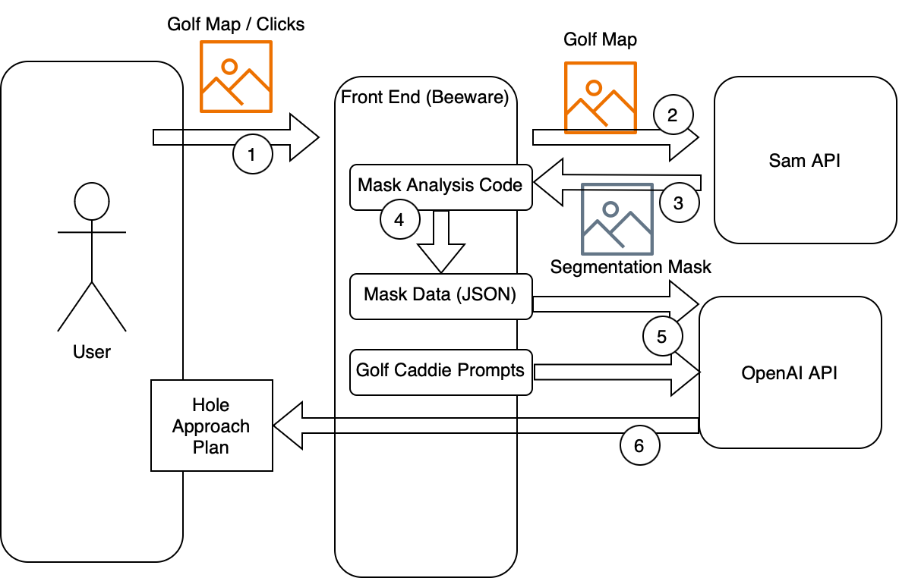

AI Golf Caddie
==============

## Overview
The AI golf caddie is a software package with a UI that helps golfers plan their approach. The AI agent analyzes a map of the golf course to suggest the series of shots that would provide the highest probability of success. This series also takes into account the golfer's skill and tee color.

## Architecture

The overall process for using AI to analyze golf course follows the below image.



### Front-End
The front end was developed using Beeware, a package which allows for developing unified front ends across platforms (mobile, web, native desktop app, etc).

### Back-End
The back-end consists of the the segmentation and LLM agent modules which analyze the map to provide suggestions. For each map, the segementation server analyzes the map using a locally-run SAM model to output segmentation masks. These masks are used as input into a center-of-mass function and bounding box function. Using inputed clicks, the bounding boxes are narrowed down to those representing actual obstacles in the hole. The outputs of these functions are given to the LLM agent which is prompted to generate golf swing suggestions.

## Installation

### Build the UI
The Beeware package (specifically Briefcase) is required for compiling and deploying the app. To install, first create a venv:

```bash
mkdir beeware-tutorial
cd beeware-tutorial
python3 -m venv beeware-venv
source beeware-venv/bin/activate
```

Next, install briefcase, so that you can run the project:
```bash
python -m pip install briefcase  # Install briefcase
```

The "aigolfcaddie" already serves as a project, so you do not need to go trhough the steps of creating a new briefcase project.

Now update `aigolfcaddie/src/aigoldcaddie/app.py` by replacing `api_key = 'REDACTED'` with your API key for ChatGPT 4-o. 

To build the project, execute the following commands:

```bash
cd aigolfcaddie
briefcase create
briefcase build
```

### Backend SAM Server

To install the backend SAM server, you need a ngrok account. Please register an account and obtain the ngrok authentication token. Replace the `<ngrok authtoken>` string within the `sam_server/install.sh` bash script.

To start the installation process run the `install.sh` bash script.
```bash
cd sam_server/sam_api
bash install.sh
```

## Usage

To use the application, first run the backend SAM server. Ensure that the `<fill-w-perm-ngrok-addr>` field is replaced with the proper permanent ngrok url found within your ngrok account page.

```bash
cd sam_server/sam_api
bash start.sh
```

To start the built UI, execute the following commands:

```bash
cd aigolfcaddie
briefcase run
```

An AI golf caddie that gives you tips on how to play a hole

.. _`Briefcase`: https://briefcase.readthedocs.io/
.. _`The BeeWare Project`: https://beeware.org/
